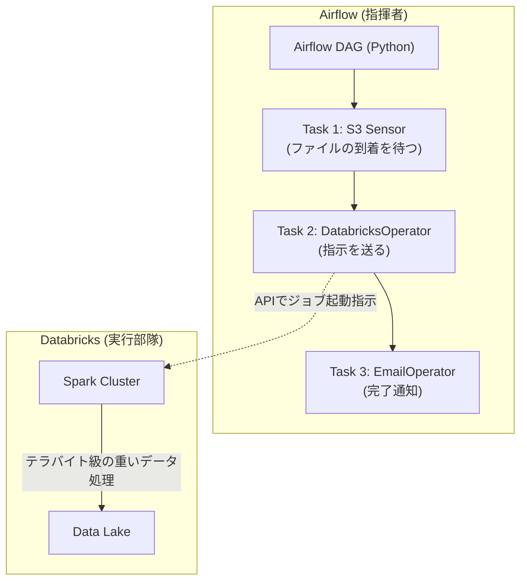

# Apache Airflow Core Mechanics

### 1. 【エンジニアの定義】Professional Definition

> **Apache Airflow**:
> Pythonコードを用いて複雑なデータ処理パイプラインの定義、スケジュールリング、および監視を行うためのプラットフォーム。Airbnbが開発しオープンソース化。
> 
> **DAG (Directed Acyclic Graph)**:
> 「有向非巡回グラフ」。Airflowにおけるワークフロー全体を定義する単位。「タスクAが終わったらタスクBとCを並行して実行する。一巡してAには戻らない」という実行順序をノードとエッジで表現したもの。
> 
> **Operators**:
> Airflow内で単一のタスクを実行するためのテンプレート。Pythonスクリプトを実行する`PythonOperator`や、Bashコマンドを実行する`BashOperator`などがある。

---

### 2. 【0ベース・深掘り解説】Gap Filling

#### ⏱️ ただのCronと何が違うのか？
Linuxの`cron`を使えば「毎朝3時にスクリプトを動かす」ことは簡単です。しかしデータ基盤では限界があります。
「APIからデータを取るスクリプトが**失敗したら**どうなる？」「もし1日止まってしまって、**過去3日分を再実行**したい時は？」
Airflowは、データエンジニアリング特有のエラーハンドリングに極めて強いです。特定のタスクが失敗すればアラートを鳴らし、途中から安全に再実行できるGUIと仕組みが備わっています。

#### 🐘 AirflowとDatabricksの連携
「Airflowで重いデータ処理を書く」のは**アンチパターン**です。
Airflowはあくまで「オーケストレーター（指揮者）」です。Airflow自体（ワーカー）のメモリ上で数GBのデータを処理してはいけません。
正しい使い方は、Airflowの`DatabricksSubmitRunOperator`を使って、「Databricks(実行部隊)よ、この巨大なクエリを実行して結果を保存せよ」と**API経由で指示だけ送る**ことです。指揮者は指揮棒を振るだけで、楽器（データ処理）は演奏しません。

---

### 3. 【アーキテクチャの視覚化】Visual Guide

Airflowがオーケストレーターに徹するモダン構成。

---

### 💡 この用語のまとめ (Key Takeaways)
*   **Airflow**: コード(Python)としてデータパイプラインを定義できる最強の指揮者。
*   **DAG**: 依存関係と実行順を示す一本道のグラフ。ループはしない（Acyclic）。
*   **指揮者のルール**: Airflowに重たい計算をさせてはいけない。計算はDatabricksやSnowflakeに投げ、Airflowは進捗を見守るだけ。
