# Azure Private Link & VNet Architecture
### 1. 【課題解決のメカニズム】Mechanism of Problems
**「パブリッククラウド」という本質的なリスク**
AWSのS3やAzureのADLS、DatabricksといったPaaSリソースは、デフォルトでインターネット上のグローバルなパブリックIPアドレスを持ちます。ファイアウォール（IP制限）で「社内のIPしか通さない」と設定していても、データ自体はインターネットという公道を通るため、経路での傍受リスクや、設定ミスによる全世界からのデータ漏洩（S3バケットの公開事故など）という致命的なインシデントに直結します。
エンタープライズや金融機関の審査において、「公道を通るな、専用の地下トンネルを掘れ」という要件を完璧に満たす技術が **Azure Private Link (Private Endpoint)** です。

### 2. 【アーキテクチャの真髄】Architectural Deep Dive
**Private Endpoint と DNSのオーバーライド**
Private Endpointを設定すると、PaaS（例えばADLS）に対して、あなたのVNet（プライベートネットワーク）内の「ローカルなIPアドレス（10.0.1.5等）」が物理的に刺さります。
しかし、コード内で `https://myatalake.blob.core.windows.net` にアクセスした際、PCは通常「グローバルIP」を解決してそちらへ向かおうとします。そこで必須になるのが **Private DNS Zone** の連携です。
VNetの内部からアクセスした時だけ、DNSサーバーが「そのURLの行き先はグローバルの 52.x.x.x ではなく、手元の 10.0.1.5 だよ」と嘘のルーティング（DNS上書き）を行います。これにより、Microsoftの超高速なバックボーン網を通る完全に閉ざされたプライペート通信が完成します。

```mermaid
graph TD
    classDef vnet fill:#1e293b,stroke:#3b82f6,stroke-width:2px;
    classDef dns fill:#312e81,stroke:#8b5cf6,stroke-width:2px;
    classDef paas fill:#7f1d1d,stroke:#f87171,stroke-width:2px;
    
    subgraph "Your Secure Azure VNet"
        VM[Databricks Worker <br/> IP: 10.0.2.10]:::vnet
        PE[Private Endpoint <br/> IP: 10.0.2.20]:::vnet
        DNS((Private DNS Zone <br/> Resolves to 10.0.2.20)):::dns
    end
    
    VM -->|Query URL| DNS
    VM -->|Data Flow Bypass Public Internet| PE
    PE -->|Microsoft Backbone| Storage[Azure Data Lake Gen2]:::paas
    
    Internet((Public Internet)) -.->|Access Blocked| Storage
```

### 3. 【実務への応用】Practical Application
* **Databricks NPIP (No Public IP) ワークスペース**:
  高度なセキュリティ要件では、Databricksのワーカーノード（VM）自体にパブリックIPを付与しない運用（NPIP）が基本です。しかしNPIPにすると、VMがインターネット上の「Databricksのコントロールプレーン」にアクセスできなくなり、ジョブが起動しません。これを解決するため、Databricksの「Control Plane API」と「Web Auth」に対してもPrivate Endpointを個別に構成し、完全にVNetの中だけで閉じたクラスタ通信網（Secure Cluster Connectivity）を構築する設計力が求められます。
