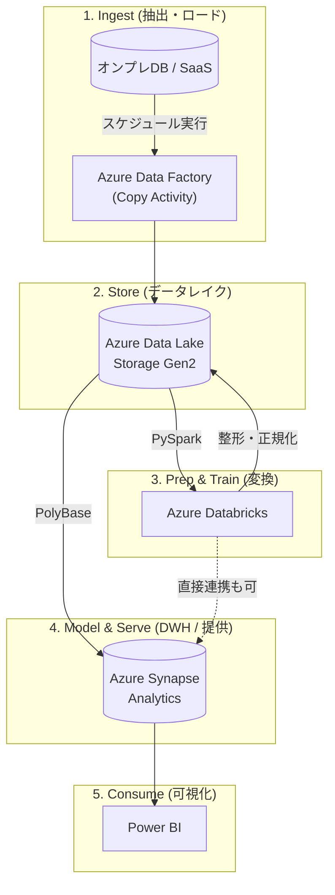

# Azure Data Engineer Associate (DP-203)

### 1. 【エンジニアの定義】Professional Definition

> **Azure Data Engineer Associate (DP-203)**:
> Microsoft Azure上で、リレーショナル・非リレーショナルデータを統合、変換、統合するデータソリューションの設計および実装能力を証明する資格。Azure Synapse Analytics、Azure Data Factory (ADF)、Azure Databricks、Azure Data Lake Storage (ADLS) などのコアリソースを網羅的に理解していることが求められる。

---

### 2. 【0ベース・深掘り解説】Gap Filling

#### 🏭 AzureにおけるETLの主役: Azure Data Factory (ADF)
オンプレミスからクラウドへデータを引っ張り上げる時、まず間違いなく使われるのが**Azure Data Factory**です。
SSIS（SQL Server Integration Services）の系譜を継ぐこのツールは、GUI上でアイコンを繋ぐだけで「毎晩DBサーバーからデータを抜いてADLSに保存する」処理（Copy Data activity）が作れます。
試験では、「オーケストレーションはADF」「重いデータ変換はDatabricksかSynapse」という役割分担が必ず問われます。

#### 🌊 Synapse Analytics vs Databricks
Azureには強力な分析環境が2つあります。どう使い分けるべきか？
*   **Azure Synapse Analytics**: Microsoft純正の全部入りモダンDWH。SQLをこよなく愛するチーム向け。専用SQLプール（旧SQL DW）と、サーバーレスSQLプールが強力。
*   **Azure Databricks**: Apache Sparkベースのオープンな分析基盤。PythonやScalaなどコードベースでゴリゴリ機械学習や複雑なETLをこなすデータサイエンス・エンジニア向け。

試験では「Sparkを細かくチューニングしたい」「Pythonの機械学習ライブラリを多用する」という要件があればDatabricksを選ぶのが正解となります。

---

### 3. 【アーキテクチャの視覚化】Visual Guide

Azure公式が提示するモダンデータウェアハウスの典型的なアーキテクチャ像。

---

### 💡 この用語のまとめ (Key Takeaways)
*   **DP-203の핵**: ADF(運ぶ) → ADLS(貯める) → Databricks(磨く) → Synapse(提供する) の黄金リレー。
*   **セキュリティと監視**: Azure Key Vaultを使ったシークレット管理や、Log Analyticsでの監視も頻出。
*   **Lambdaアーキテクチャ**: バッチ処理(ADF)とストリーム処理(Event Hubs + Stream Analytics)のハイブリッド設計に慣れること。
