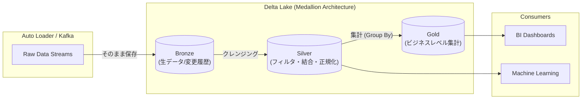

# Databricks Certified Data Engineer Associate

### 1. 【エンジニアの定義】Professional Definition

> **Databricks Certified Data Engineer Associate**:
> Databricksプラットフォームを使用して、データ処理の基本タスク（ETL）を実行する能力を証明するエントリーレベル資格。Delta Lakeの基礎、Databricks SQL、Sparkの基本概念、ジョブのスケジューリング、およびUnity Catalogの基礎権限管理などが問われる。

---

### 2. 【0ベース・深掘り解説】Gap Filling

#### 🏗️ 「メダリオンアーキテクチャ」が試験の心臓部
この試験を突破するために最も重要な概念は**Medallion Architecture（ブロンズ・シルバー・ゴールド）**のデータパイプライン設計です。
*   **Bronze層 (Raw)**: APIやファイルから持ってきた生のJSONなどを「そのままの形」で保存するゴミ箱兼履歴層。
*   **Silver層 (Enriched)**: Bronzeのデータを読み、日付フォーマットを揃えたり、NULLを除去したり、テーブル同士を結合したりして「綺麗に整形した」クレンジング層。
*   **Gold層 (Curated)**:  Silverを参照して「部門別売上サマリ」「マーケティング用KPI」など、BIツールが即座に読める状態に集計済みのビジネス層。

試験では「Bronze層の目的として正しいものはどれか？」「データウェアハウスの代わりになる集計層はどれか？」といった役割の理解が深く問われます。

---

### 3. 【アーキテクチャの視覚化】Visual Guide

Databricks公式が推奨するメダリオンアーキテクチャの流れ。

---

### 💡 この用語のまとめ (Key Takeaways)
*   **Medallion Architecture**: Bronze(生の保存) → Silver(綺麗な明細) → Gold(集計・BI用)の3層構造。
*   **Auto Loader**: クラウドストレージに新しく到着したファイルだけを差分で読み込む超便利機能。試験頻出。
*   **Delta Live Tables (DLT)**: SQLやPythonで「データの流れ」を定義するだけで処理が動く、Databricksのパイプライン自動化機能。
