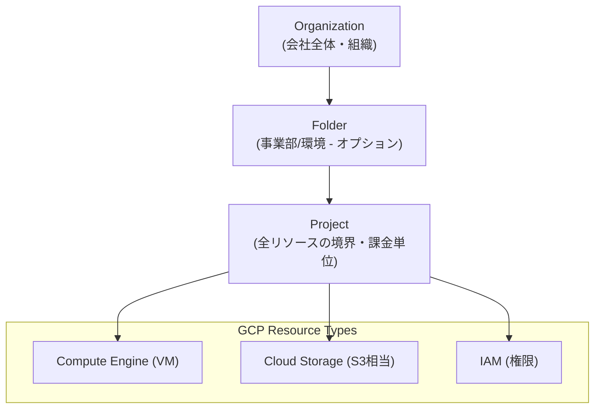

# Google Cloud ACE (Associate Cloud Engineer) Roadmap

### 1. 【エンジニアの定義】Professional Definition

> **Google Cloud ACE**:
> Google Cloud環境でのアプリケーションのデプロイ、エンタープライズソリューションのモニタリングや運用管理能力を問う登竜門的資格。GCPの広範なサービス（Compute, Storage, Network, IAM等）の基礎とCLI操作の理解が必要となる。

---

### 2. 【0ベース・深掘り解説】Gap Filling

#### ☁️ "gcloud" コマンドラインの圧倒的重要度
他のクラウド資格（AWSやAzure）と比べ、GCP ACEが際立っている特徴は**コマンドラインツール（CLI）からの出題が非常に多い**ことです。
「Web画面のどこをクリックするか」ではなく、`gcloud compute instances create ...` や `gsutil cp ...` のような具体的なコマンド体系を理解しているか問われます。実務ではシェルスクリプトでインフラ自動化を行うため、この知識は即戦力になります。

#### 🔑 IAMとプロジェクト構造の独自性
Azureの「サブスクリプション/リソースグループ」やAWSの「アカウント」にあたるのが、GCPの「Project」です。
そしてGCPの**IAM（権限管理）**は強力ですが独特です。「プリミティブロール（閲覧者、編集者、オーナー）」と「事前定義ロール」の違いを明確にし、原則として「最小特権の原則を満たす事前定義ロール」を付与するアーキテクチャがテストで問われます。

---

### 3. 【アーキテクチャの視覚化】Visual Guide

GCP ACEで必ず理解すべき、プロジェクト・リソース群の階層モデル。

---

### 💡 この用語のまとめ (Key Takeaways)
*   **CLIの徹底**: `gcloud` (全体管理), `gsutil` (ストレージ), `bq` (BigQuery), `kubectl` (K8s) の使い分けをマスターする。
*   **Project単位の管理**: GCPの課金と権限の基本単位は「Project」である。
*   **IAMと最小特権**: 常に「最も権限の少ない事前定義ロール」を選ぶ選択肢が正解になるケースが多い。
