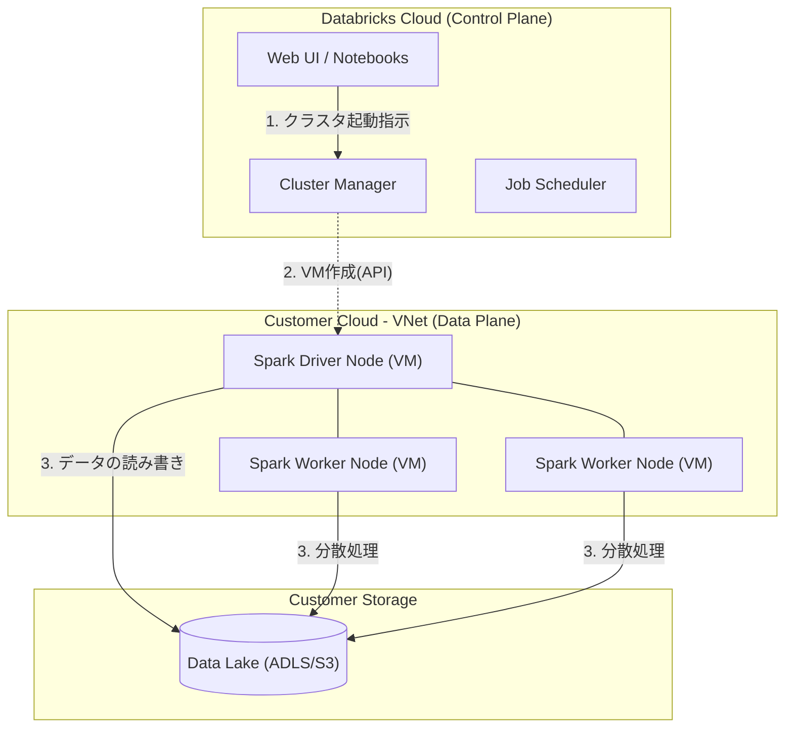

# Databricks Architecture (Control Plane vs Data Plane)

### 1. 【エンジニアの定義】Professional Definition

> **Control Plane (コントロールプレーン)**:
> Databricksが自社クラウド内でホスト・管理する中央管理領域。Web UI、ノートブックストレージ、ワークスペース管理、ジョブスケジューラ、およびクラスタ管理機能（DBR/VMの制御コマンド）が含まれます。
> 
> **Data Plane (データプレーン)**:
> 顧客(あなた)のクラウド環境（Azure/AWS/GCP）内にデプロイされる計算リソース領域。実際のVM（Sparkクラスタ）が立ち上がり、顧客のデータストア（ADLSやS3）に対してデータを処理します。データ自体がControl Planeに送信されることはありません。

---

### 2. 【0ベース・深掘り解説】Gap Filling

#### 🔑 「誰が何を管理するのか？」(責任共有モデル)
Databricksが「セキュア」と言われる理由がここにあります。
通常、フルマネージドのSaaSを使うと「自社の機密データを外部サービスに渡す」ことになり、セキュリティ審査が厳しくなります。しかし、Databricksアーキテクチャでは**「データは自室(Data Plane)から一歩も外に出ない。シェフ(Control Plane)はレシピと指示だけを自室に送ってくる」**という仕組みを採用しています。

#### 🌩️ クラスタが立ち上がる裏で何が起きている？
Web UIで「クラスタ起動」ボタンを押すと、以下の通信が発生します。
1. **Control Plane**がクラウドのAPI（Azure Resource Manager等）に「VMを3台作れ」と指示を出します。
2. 顧客のVNet（Data Plane）内にVMが立ち上がります。
3. 立ち上がったVMが**Control Plane**の司令塔に対して「準備できました」と安全な返事(セキュア通信)を返します。
4. ノートブックに書いたSparkコードがData Planeに送られ、顧客のデータレイク（ADLS等）のデータを直接処置・加工します。

---

### 3. 【アーキテクチャの視覚化】Visual Guide

Databricksの分離アーキテクチャの全体像。

---

### 💡 この用語のまとめ (Key Takeaways)
*   **Control Plane**: Databricks社が管理する「脳とUI」。ノートブックやメタデータを持つ。
*   **Data Plane**: 自社のクラウド上に作られる「手足」。データ加工を実際に行う。
*   **セキュリティの核心**: 生のデータは絶対にControl Planeには流れ込まない。
