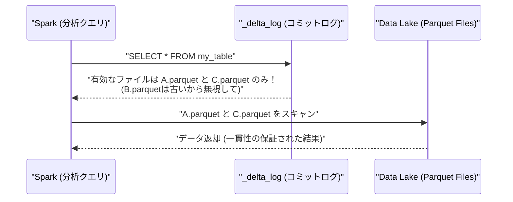

# Delta Lake Core Dynamics

### 1. 【エンジニアの定義】Professional Definition

> **Delta Lake**:
> 既存のデータレイク（Parquetファイル群）の上に、ACIDトランザクション、タイムトラベル（履歴管理）、スキーマの強制/進化などの機能を追加するオープンソースのストレージレイヤー。
> 
> **_delta_log**:
> Delta Lakeにおける全てのトランザクション記録（コミット）を保持するJSON/Parquetファイルを含む隠しディレクトリ。データの「現在の正式な状態」は、実際のParquetファイルとこのログの組み合わせで決定される。

---

### 2. 【0ベース・深掘り解説】Gap Filling

#### 💾 なぜParquetだけではダメなのか？
かつてのデータレイクは、単にADLSやS3にParquetファイルを積み上げるだけでした。しかし、この手法には致命的な弱点がありました。
**「もしデータ更新（UPDATE）中にサーバーが落ちたら？」**
半分だけ更新された壊れたParquetファイルが生まれ、分析クエリはエラーで死にます。
Delta Lakeは、RDBMS（MySQL等）が持っていた「トランザクションログ（失敗したらロールバックする仕組み）」をデータレイクに持ち込みました。それが `_delta_log` フォルダです。

#### ⏳ タイムトラベルの魔法
Delta Lakeで「間違えてデータを消したから昨日の状態に戻して！」と言われたら、1行のSQLで直ります。
`RESTORE TABLE my_table TO TIMESTAMP AS OF '2023-10-01'`
なぜこれが可能かというと、Delta LakeはデータをUPDATEやDELETEしても、**古いParquetファイルをすぐには物理削除しない**からです。`_delta_log`が「今はVer.2を見ろ、Ver.1のファイルは無視しろ」と指示しているだけなので、ログの読み込み先を切り替えるだけで時間を遡れます（※不要になった古いファイルは `VACUUM` コマンドで物理削除します）。

---

### 3. 【アーキテクチャの視覚化】Visual Guide

Delta Lakeの読み込みとコミットログの解決ステップ。

---

### 💡 この用語のまとめ (Key Takeaways)
*   **Delta Lake**: Parquetファイル + トランザクションログ（`_delta_log`）の組み合わせ技術。
*   **ACIDトランザクション**: 途中で落ちてもデータが壊れない。データレイクの弱点を克服。
*   **Time Travel & VACUUM**: 古いデータは保持されるためタイムトラベル可。ゴミ掃除には `VACUUM` が必要。
