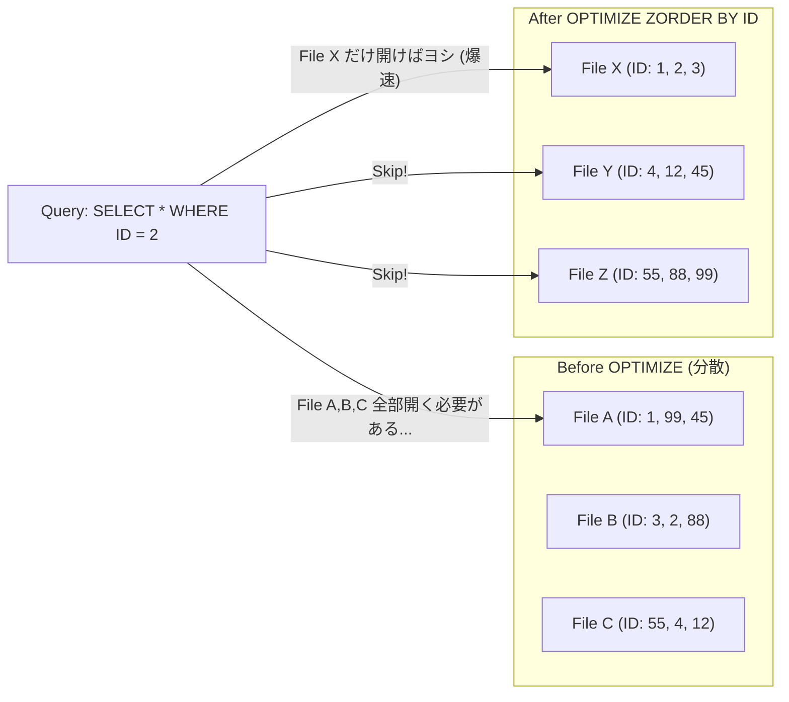

# Databricks Performance & Optimization

### 1. 【エンジニアの定義】Professional Definition

> **Adaptive Query Execution (AQE)**:
> Hiveや今までのSparkではクエリ実行前に「実行計画」を固定していましたが、Spark 3.0(AQE)ではクエリ実行中の段階的な結果を見て、「シャッフルのパーティション数を調整する」「Join戦略をブロードキャストJoinに変更する」など、動的に計画を**最適化**する機能。
> 
> **OPTIMIZE & Z-ORDER**:
> たくさんの小さなファイルを少数の中規模ファイルにまとめる（Bin-packing: `OPTIMIZE`）と同時に、指定したカラムのデータが物理的に近くに配置されるよう並べ替える（`Z-ORDER`）Delta Lake専用のファイルレイアウト最適化技術。

---

### 2. 【0ベース・深掘り解説】Gap Filling

#### 🐢 クラスタをデカくしても遅い理由
Databricksで「とにかく遅い」という相談の9割は、**Small File Problem（小ファイル問題）**か**Data Skew（データの偏り）**です。
*   **Small File Problem**: 毎分ストリーミングでデータを保存すると、1KBの小さなParquetファイルが数百万個できます。Sparkがこのデータを読み込む時、「ファイルを開きメタデータを取得する時間」だけで全体の80%を消費し激遅になります。解決策は定期的な `OPTIMIZE` コマンドです。

#### 🎲 Z-ORDER という最強のインデックス
SQLでいう「インデックス」に近いのが `Z-ORDER` です。
例えば「顧客ID」で頻繁にWHERE絞り込みをする場合、`OPTIMIZE table_name ZORDER BY (customer_id)` を実行すると、ファイルをまたいで顧客IDの順番が揃うように整理されます。
クエリ時、Databricksはファイルのメタデータ（このファイルにはID:100〜200が入っている）だけを読み取り、目当てのIDがないファイル群は**丸ごとスキップ（Data Skipping）**します。数百GBの読み込みが瞬時に終わる魔法です。

---

### 3. 【アーキテクチャの視覚化】Visual Guide

OPTIMIZE と Z-ORDER による Data Skipping の仕組み。

---

### 💡 この用語のまとめ (Key Takeaways)
*   **AQE**: エンジン実行中に動的に賢くなるSpark 3.0の標準機能。
*   **OPTIMIZE**: 大量のゴミ箱（小ファイル）を大きなコンテナに整理して、スキャン速度を劇的に上げる。
*   **Z-ORDER**: 特定の列で「Data Skipping」を発動させるための物理的ソート機能。
