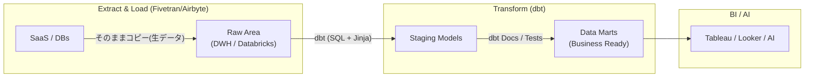

# dbt (Data Build Tool) Fundamentals

### 1. 【エンジニアの定義】Professional Definition

> **dbt (Data Build Tool)**:
> データウェアハウス内にロードされた生データに対して、SQLのみを使ってデータ変換（Transform）処理を行うためのオープンソースツール。ETLの「T」の部分に特化している。
> 
> **Analytics Engineering**:
> バックエンド（システム設計）とデータ分析（ビジネス理解）の橋渡しをする新しいロール。dbtを用いて、ソフトウェアエンジニアリングのベストプラクティス（Gitバージョン管理、CI/CD、テスト）をSQLデータ変換パイプラインに持ち込む。

---

### 2. 【0ベース・深掘り解説】Gap Filling

#### 🔧 「ただのSQL群」から「データプロダクト」へ
昔のデータ分析は、誰が書いたか分からない数千行のストアドプロシージャや、毎朝動く巨大なバッチ処理SQLの塊（負債）でした。
dbtはこれに革命を起こしました。
*   **依存関係の自動解決**: `ref('stg_users')` のような独自のJinjaテンプレート関数を使うことで、「どのSQLを実行すれば、次のSQLが動くか」という依存グラフ（DAG）を自動で作成し、正しい順序で実行してくれます。
*   **自動テストの力**: YAMLファイルに `not_null` や `unique` と数行書くだけで、「このカラムに空データが入ってこないか？」を毎朝自動でテストしてくれます。バグのあるデータがBIツール（TableauやLooker）に表示される前に防げます。

#### 🌟 なぜ今、dbtが必須級スキルなのか？
Snowflake、BigQuery、DatabricksといったクラウドDWHが超高速になったため、データを外部サーバーで加工せず、**直接DWHの中で加工する（ELTアーキテクチャ）**のが主流になりました。このDWH内部での「T（変換）」の指揮を執るオーケストレーターとして、dbtはデファクトスタンダードになりました。

---

### 3. 【アーキテクチャの視覚化】Visual Guide

モダンデータスタックにおけるdbt（ELTアーキテクチャ）の位置づけ。

---

### 💡 この用語のまとめ (Key Takeaways)
*   **dbt**: 分析SQLの世界に、Gitやテストといった「ソフトウェア開発の規律」をもたらした革命的ツール。
*   **Jinjaとref関数**: テーブル名の手打ちハードコードを廃止し、依存関係（DAG）を自動生成する。
*   **ELTの絶対的王者**: データを事前に加工せず、DWHの「中で」加工する現代アーキテクチャに必須。
