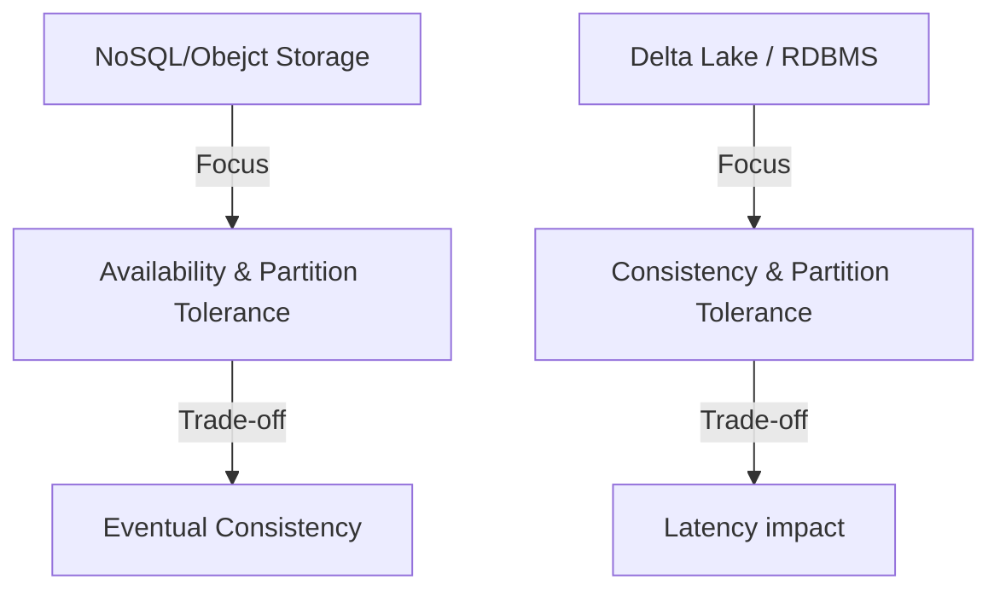

# CAP/PACELC Theorem in Modern Data
### 1. 【エンジニアの定義】Professional Definition
**CAP定理**: 分散システムはConsistency（一貫性）、Availability（可用性）、Partition tolerance（分断耐性）のうち2つしか満たせない。
**PACELC定理**: CAPの拡張。P（分断時）はAかCの二者択一だが、E（平常時）でもL（レイテンシ）とC（一貫性）のトレードオフが発生する。
### 2. 【0ベース・深掘り解説】Gap Filling
ADLS（Azure Data Lake）やS3は「最終結果整合性（Eventual Consistency）」を取るシステム。ファイルを上書きした直後に読み込むと、古いファイルが返ってくることがある。Sparkのバッチでこれが起きるとデータ欠損になるため、Delta LakeのようなACIDトランザクション層（Cを保証する層）が必要になる。

