# CAP Theorem & PACELC 
### 1. 【課題解決のメカニズム】Mechanism of Problems
**「絶対に壊れず、常に最新で、絶対に応答するシステム」は存在しない**
NoSQLやNewSQLなど様々なデータベースが登場し、データストアの選定がシステム設計の要となっています。しかし「要件は全部」と言って完璧なDBを探求するのは素人です。
分散システム（データを複数のサーバーに分けて置くこと）において、物理法則の如く立ちはだかるのが CAP 定理です。
一貫性（**C**onsistency：全員が同じ最新データを見る）、可用性（**A**vailability：常にシステムが応答する）、分断耐性（**P**artition Tolerance：ネットワークが切断されてもシステムが動き続ける）の3つのうち、原理的に同時に満たせるのは2つ（実質的にはPを前提として、CかAを選ぶ）しかないという残酷な事実です。

### 2. 【アーキテクチャの真髄】Architectural Deep Dive
**PACELC理論による完全なモデル化**
CAP定理はさらに進化し、PACELC定理として現代の基盤設計を支配しています。
`If Partition (P), how does the system trade off Availability and Consistency (A and C); Else (E), when the system is running normally, how does it trade off Latency and Consistency (L and C)?`
ネットワークが切れていない平時 (Else) であっても、データを遠くのノードへ完璧に複製（Consistency）しようとすれば、応答速度が遅くなる（Latency。LCトレードオフ）。

```mermaid
graph LR
    classDef C fill:#1e293b,stroke:#3b82f6,stroke-width:2px;
    classDef A fill:#312e81,stroke:#8b5cf6,stroke-width:2px;
    
    subgraph "Partition Detected (Network Failure)"
        P{Choose:} -->|CP| CP[Wait for Sync: Timeout Error]:::C
        P -->|AP| AP[Return Old Data: No Error]:::A
    end
    
    subgraph "Normal Operation (Else)"
        E{Choose:} -->|EC| EC[Sync All Replicas: High Latency]:::C
        E -->|EL| EL[Async Replica: Low Latency]:::A
    end
```

### 3. 【実務への応用】Practical Application
* **データベース選定の意思決定**:
  * **RDBMS (PostgreSQL, MySQL等)**: 典型的な **CA / CP** 志向。障害が発生すると書き込みをロックしエラーを返しますが、金銭データなど「古すぎるデータや壊れたデータが見えると一発アウト」なシステムで採用します。
  * **Cassandra / DynamoDB (デフォルト)**: 典型的な **AP / EL** 志向。障害が起きてもとりあえず応答し（場合によっては数分前の古いデータ）、裏で非同期に同期します。秒間数万のアクセス（閲覧履歴やIoTログ）をさばくにはこれしかなく、最終的にデータが揃えばOK（Eventual Consistency）というドメインで採用します。
