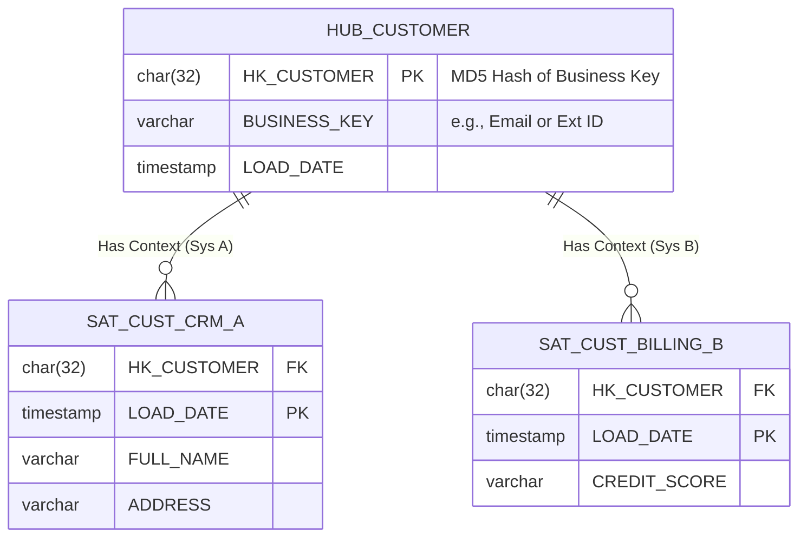

# Lakehouse Modeling: Kimball vs Data Vault 2.0
### 1. 【課題解決のメカニズム】Mechanism of Problems
**「ビジネスの変更」がDWHを破壊する歴史的な問題**
従来のデータウェアハウス設計におけるデファクトスタンダードである「ディメンショナル・モデリング（Kimballスタースキーマ）」は、BIツールからの検索パフォーマンスに特化しています。
しかし、新しい取引先システムが追加されたり、業務プロセスが根底から変化した場合、既存のFact（事実）およびDimension（属性）のスキーマを直接ALTER（書き換え）し、過去データをマイグレーションする膨大な工数が発生します。この「変化に対する脆さ」と「ベンダーロックインされたレガシーETL」を脱却し、クラウドスケールのLakehouseにおける俊敏性（Agility）を獲得するために考案されたのが Data Vault 2.0 です。

### 2. 【アーキテクチャの真髄】Architectural Deep Dive
**ハッシュベースの疎結合アーキテクチャ (Hub, Link, Satellite)**
Data Vault 2.0では、データシステムを以下の3要素に完全に分離します。
1. **Hub (ハブ)**: ビジネスキー（例: eメール、UUID、口座番号）の不変リスト。格納されるのは Business Key と、それをMD5またはSHA-1でハッシュ化したハッシュキー（Hash Key）、およびデータ到着日時とソース元情報のみ。属性は一切持ちません。
2. **Link (リンク)**: 複数のHub間の関係性（トランザクションなど）を表します。各Hubのハッシュキーを持ち、関係そのものを不変の事実として記録します。
3. **Satellite (サテライト)**: HubまたはLinkに関する変化する「属性情報（名前、価格、住所など）」を履歴として保持します。データの更新（SCD Type 2）はすべてここで行われます。

これにより、新しいシステム（CRM Bなど）が追加導入された場合、既存のテーブル設計を一切変更することなく、「新しいSatellite」を元のHubにぶら下げる（Additive Change）だけで拡張が完了します。
分散処理（Sparkなど）においては、ビジネスキーをハッシュキー化しておくことで、ロード処理同士のロック待ち（依存関係）を排除し、全テーブルをパラレル（並行）で超高速ロードできるという極めて実践的なメリットがあります。

### 3. 【実務への応用】Practical Application
* **情報マート層（Data Mart Layer）への変換**:
  * Data Vaultは「柔軟な取り込みと履歴の保存」には最強ですが、結合（JOIN）の数が指数関数的に増えるため、分析ユーザーやBIツールが直接クエリを叩くのには向いていません（クエリパフォーマンスが悪化）。
  * したがって実務では、Raw Data（Bronze層）から Data Vault（Silver層）へ並列統合し、最後に集計パイプラインを回してBI向けに Kimball の Star Schema（Gold層）ビューを生成する「2段階アプローチ」が必須アーキテクチャとなります。
* **遅延到着データの処理**:
  * トランザクションシステムの障害で、順番が逆転して古い更新履歴が遅れてLakehouseに到着した場合でも、Satelliteは単なるInsert-Onlyな追記モデルであるため、ロードエラーを起こさず、後段の集計ロジックで安全に時系列順に再構築（PIT: Point-in-Time Table の活用）できます。
