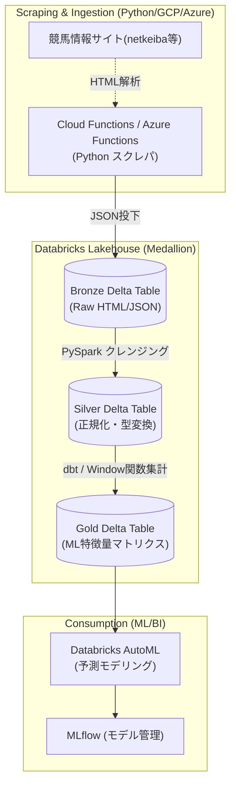

# Project: 競馬データ分析基盤

### 1. 【エンジニアの定義】Professional Definition

> **競馬データエンジニアリング計画**:
> Webからのデータスクレイピング（Extract）、Databricksによる分散データクレンジング・特徴量エンジニアリング（Transform）、およびクラウドDWHへの保存（Load）という、モダンデータスタックの基本を網羅した実践的フルスクラッチ・ポートフォリオ。

---

### 2. 【0ベース・深掘り解説】Gap Filling

#### 🏇 なぜ競馬データはETLの最高の練習台なのか？
競馬データは「ただの数字の羅列」ではありません。
*   **多様なデータ構造**: 過去数十年のレース結果（表データ）、出走馬の血統（ツリー構造）、オッズの変動（時系列データ）。これらバラバラのデータをキーで繋ぎ合わせるRDB設計の知見が身につきます。
*   **ダーティデータの宝庫**: クレイピングしたデータは「取消」「中止」「同着」といったイレギュラーなノイズが大量に含まれています。これらを安全に弾いたり補完したりするPySparkの `fillna()` や `when().otherwise()` の実戦経験が積めます。
*   **特徴量生成（Feature Engineering）**: 「前走からの日数」「過去3戦の平均タイム」など、Window関数の高度な使い方（`partitionBy().orderBy().rowsBetween()`）を嫌というほど学べます。

#### 🏗️ 設計方針：メダリオンアーキテクチャの適用
このプロジェクトではDatabricks認定で学ぶ「メダリオン」を忠実に再現します。
1.  Python（BeautifulSoup等）で取きた生のHTML/JSONをそのままADLS（Bronze層）に投下。
2.  Databricks Autoloaderを利用して自動的に差分を読み込み、不要な列を削ってParquetでSilver層へ。
3.  dbtを使ってSilver層のテーブル同士を繋ぎ、機械学習モデルがそのまま食える行列データ（Gold層）を生成。

---

### 3. 【アーキテクチャの視覚化】Visual Guide

完全自動化された競馬データ収集・処理パイプライン。

---

### 💡 この用語のまとめ (Key Takeaways)
*   **実践的ETLの登竜門**: 競馬データは「データの汚さ」「結合の複雑さ」「時系列」の全要素が詰まった最高の教材。
*   **Window関数の極意**: 「過去◯戦の成績」を出すためにSQL/PySparkの高度な分析関数を習得できる。
*   **最終ゴール**: 自作のデータパイプラインからMLflowまでを繋ぎ、「データ基盤構築からAI予測まで1人で完結できる」証明とする。
