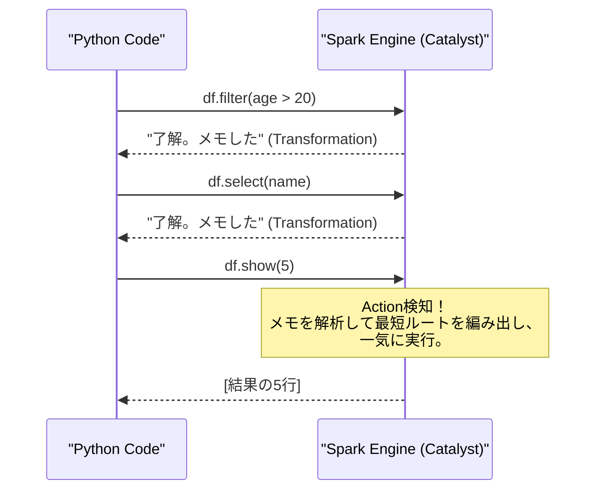

# Action, Transformation & Lazy Evaluation

### 1. 【エンジニアの定義】Professional Definition
> **Transformation**:
> `filter()`, `select()`, `groupBy()` など、元データに対する「変形の指示」。実行しても計算はされない。
> **Action**:
> `show()`, `write()`, `count()` など、実際に結果を出力・保存する指示。ここで初めてSparkが動き出す。
> **Lazy Evaluation (遅延評価)**:
> Actionが呼ばれるまで計算を引き伸ばし、全体の処理フロー（DAG）を見てから最も効率の良い最短ルートで計算を実行する最適化の仕組み。

### 2. 【0ベース・深掘り解説】Gap Filling
#### 🔮 カタリスト(Catalyst Optimizer)の魔法
なぜこんな回りくどいことをするのでしょうか？
例えば「1億行のデータから、東京の人を絞り込んで（Filter）、その中で10件だけ抽出する（Limit）」というコードを書いたとします。
Pandasなら1億行すべて舐めてから10件出しますが、Spark（Lazy Evaluation）は「最終的に10件だけでいいのなら、最初からファイルの上から10人東京の人を見つけた瞬間にファイルを読むのをやめよう」と**計画を裏で書き換え**ます。
これが遅延評価による劇的なパフォーマンス向上の正体です。

### 3. 【アーキテクチャの視覚化】Visual Guide

### 💡 この用語のまとめ (Key Takeaways)
* **TransformationとAction**: スケジュールを立てるのが前、実行に移すのが後。
* **Catalyst Optimizer**: 勝手にコードを賢く書き換えてくれるSpark最強のコンパイラ。
