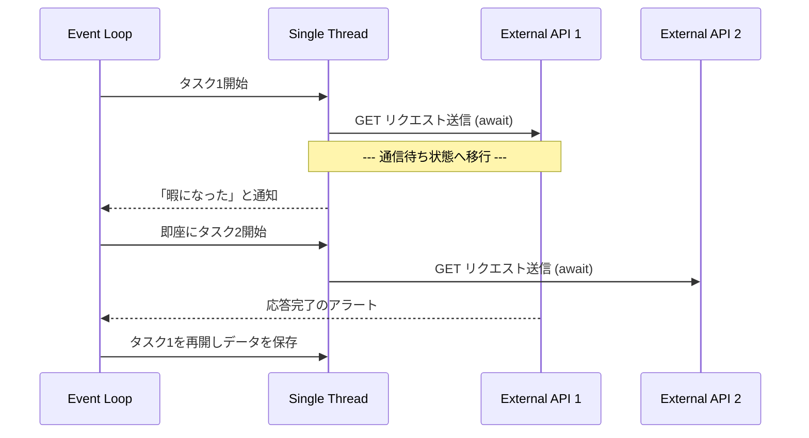

# Python AsyncIO & Networking I/O
### 1. 【課題解決のメカニズム】Mechanism of Problems
**「通信待ち時間」という無駄な空白**
データエンジニアリングで頻繁に発生するのが、「外部のWeb APIからデータを収集してDWHに保存する」処理です。例えば、1000個の異なるエンドポイントにリクエストを投げる処理を、標準の `requests.get()` の `for` ループで書いたとします。
1回のAPIの応答に「1秒」かかる場合、1000件のデータを取るのに**1000秒（約16分）**かかります。
これに対し、「1つ目のリクエストを投げて、APIのサーバーが処理を行って返事をくれるまでの1秒の待ち時間に、2つ目、3つ目のリクエストを別の回線で投げてしまえばいい」という発想が非同期処理 (Asynchronous I/O) です。

### 2. 【アーキテクチャの真髄】Architectural Deep Dive
**Event Loop と シングルスレッド非同期**
マルチスレッドと非同期（AsyncIO）はどう違うのでしょうか？
マルチスレッドは「OSが複数のスレッド（労働者）を用意し、別々の仕事をさせる」ことですが、Pythonでは前述のGIL（グローバルインタプリタロック）のせいで上手く動作しないことが多々あります。
Pythonの `asyncio` モジュールでは、スレッドはたった1つ（1人の労働者）しかいません。その代わり、**イベントループ (Event Loop)** という超高速なタスク管理システムが中央に座ります。
労働者はAPIにリクエストを投げると、`await` (待機) 状態に入ります。イベントループは「あ、こいつ今ヒマ（待ち状態）になったな」と検知し、瞬時に別のタスク（次のリクエストを投げる処理）を労働者に割り当てます。
この高速な切り替え（コンテキストスイッチ）により、1つのスレッドで1000個のAPIリクエストをほぼ同時に投げることができ、1000秒かかっていた処理が **2〜3秒で完了** します。

### 3. 【実務への応用】Practical Application
* **aiohttp の活用**:
  標準の `requests` ライブラリは同期型なので、`asyncio` の中では使えません（スレッド全体をブロックしてしまうため）。外部APIを非同期で叩く場合は、`aiohttp` や `httpx` といった非同期特化のライブラリを使用するのが実務の必須要件です。
* **Semaphore（セマフォ）による並行数制御**:
  1000回一気にリクエストを投げると、大概のAPIサーバーは「DoS攻撃を受けた」と判定して `429 Too Many Requests` のエラーを返してブロックしてきます。
  実務では必ず `asyncio.Semaphore(10)` などを使って、「同時に投げるリクエストは最大10個まで」といったスロットル制御（Throttling）を組み込むことが不可欠です。
