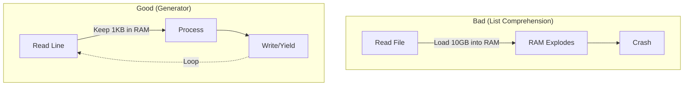

# Python in Data Engineering (Core)

### 1. 【エンジニアの定義】Professional Definition
> **Python Core for DE**:
> データ基盤開発において、スクリプトの保守性とリソース効率を最大化するPythonの基礎知識。単純なfor文だけでなく、ジェネレータ（`yield`）による省メモリ処理や、辞書内包表記を用いた高速な変換、型ヒント（Type Hinting）を用いたエラー防止が必須となる。

### 2. 【0ベース・深掘り解説】Gap Filling
#### 🐘 なぜジェネレータ(`yield`)が必須なのか？
100GBのログファイルを処理するとき、中級者までのPythonエンジニアは `readlines()` を使ってファイルを一括でリストに読み込みます。結果、サーバーは数秒でOOM（Out Of Memory）を起こして死にます。
データエンジニアは `yield` を使って「1行読んで処理し、捨てる」フローを作ります。これにより、メモリ消費量は常に「1行分(数バイト)」に抑えられ、100GBでもPBでも同じ16GBのPCで処理できるようになります。

### 3. 【アーキテクチャの視覚化】Visual Guide

### 💡 この用語のまとめ (Key Takeaways)
* **ジェネレータ**: ビッグデータ時代において限られたメモリで巨大ファイルを裁くための必須文法。
* **型ヒント(Typing)**: データパイプラインの途中で「文字列が来るはずがINTが来た」等のバグを未然に防ぐ。
