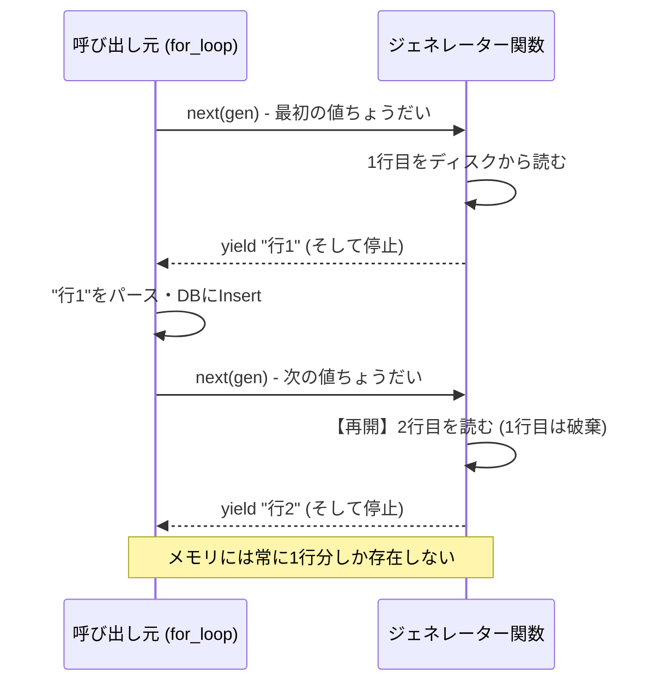

# Generators, Iterators & Lazy Evaluation
### 1. 【課題解決のメカニズム】Mechanism of Problems
**「全部メモリに乗せる」という破滅的な思考**
100GBのCSVファイルを処理しろと言われたとき、`lines = open('data.csv').readlines()` と書いた時点で、Pythonは100GBのデータをすべてメモリ（RAM）上の List オブジェクトに展開しようと試み、即座にサーバーをクラッシュさせます。
無限に続くデータや、RAMの限界を超えるデータを「1行ずつ安全に、舐めるように処理する」ための仕組みが「ジェネレーター (Generators)」による遅延評価 (Lazy Evaluation) です。

### 2. 【アーキテクチャの真髄】Architectural Deep Dive
**`yield` による「状態の一時停止と再開」**
関数内で `return` ではなく `yield` を使うと、その関数は「値を返して終了する」のではなく「値を返した時点で状態（ローカル変数など）をフリーズして一時停止し、次に `next()` が呼ばれるまで待機する」特殊なオブジェクトになります。
ジェネレーターは「今処理している1つの要素」しかメモリ空間に置かないため、1万行のファイルだろうと1億行のファイルだろうと、メモリ消費量は「数バイト」で一定を保ちます。

### 3. 【実務への応用】Practical Application
* **超絶省メモリなETLパイプライン**:
  AWS S3上の巨大なファイルをBoto3でストリーム読み込みし、`yield` でチャンク（1000行ずつなど）ごとに後段のAPIやデータベースに流し込むことで、コンテナのメモリサイズを最小（256MB程度）に抑えつつ無限のデータを処理するパイプラインが構築できます。
* **メモリ枯渇のアンチパターン**:
  ジェネレータから受け取った値を、うっかり `result_list.append(data)` のようにループ内で巨大なリストに貯め込んでしまっては遅延評価の意味がありません。受け取った端から外部（DBなど）に吐き出す（Sink）アーキテクチャにすることが肝要です。
