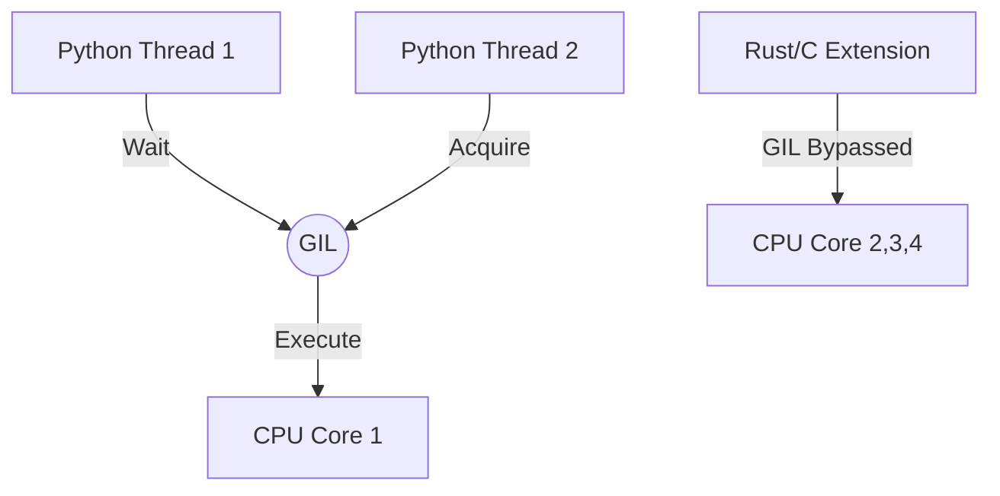

# Python GIL & Multiprocessing Internals
### 1. 【エンジニアの定義】Professional Definition
**GIL (Global Interpreter Lock)**: CPythonにおいて、一度に1つのスレッドしかPythonバイトコードを実行できないようにする排他ロック機構。データ処理において、単一プロセス内のマルチスレッド化ではCPUバウンドなタスク（計算処理）がスケールしない根本原因。
### 2. 【0ベース・深掘り解説】Gap Filling
DEが陥る罠：データ変換を速くしようと `concurrent.futures.ThreadPoolExecutor` を導入したが、全く速くならない。これはGILが原因。
解決策：`ProcessPoolExecutor`でマルチプロセス化するか（メモリ消費大）、Pandas/Polarsのように裏側でC/Rustレイヤー等を利用しGILを解放するライブラリを叩くこと。

