# GIL & Multiprocessing Architecture
### 1. 【課題解決のメカニズム】Mechanism of Problems
**「スレッドを増やせば速くなる」はPythonでは通用しない**
JavaやC#の背景を持つエンジニアがPythonで重い計算（CPUバウンド）を行う際、真っ先に使おうとするのが `threading` モジュールです。ところが、4コアのCPUでもCPU使用率が25%（1コア分）から上がらず、まったく高速化されないという壁にぶつかります。
これは Python (厳密にはCPython実装) の中核にある **GIL (Global Interpreter Lock)** という「1度に1つのスレッドしかPythonのバイトコードを実行してはならない」という絶対的なロック機構が存在するためです。この制限を回避し、マシンの全コアをフルに使い切るための正解が、OSレベルでメモリ空間をごと分割する `multiprocessing` の活用です。

### 2. 【アーキテクチャの真髄】Architectural Deep Dive
**OSプロセスのフォークとIPC (Inter-Process Communication)**
マルチスレッドが「同じ部屋（メモリ空間）で複数人が交代で作業する（Pythonでは大蔵省の許可=GILが必要）」のに対し、マルチプロセスは「部屋（メモリ）ごと複製し、全く別の独立した作業空間を作る」アプローチです。
Windowsでは `spawn`、Unix系では `fork` の仕組みでプロセスが分身を生成します。別々のプロセスになるためGILの制約は受けませんが、今度はプロセス間でデータを受け渡すために「Pickle（シリアライゼーション）」と「IPC通信（パイプやソケット）」という重いオーバーヘッドが発生します。

```mermaid
graph TD
    classDef main fill:#1e293b,stroke:#3b82f6,stroke-width:2px;
    classDef sub fill:#312e81,stroke:#8b5cf6,stroke-width:2px;
    
    A[Main Process <br/> Memory A]:::main -->|Fork/Spawn + Pickle Data| B(Sub Process 1 <br/> Memory B):::sub
    A -->|Fork/Spawn + Pickle Data| C(Sub Process 2 <br/> Memory C):::sub
    
    B -->|CPU 100%| B1[Process Heavy Data]:::sub
    C -->|CPU 100%| C1[Process Heavy Data]:::sub
    
    B1 -->|Return Pickled Result| A
    C1 -->|Return Pickled Result| A
```

### 3. 【実務への応用】Practical Application
* **使い分けの極意**:
  * **I/Oバウンド（通信・ファイル待ち）**: APIを叩くだけ、巨大ファイルをダウンロードするだけ等の処理は `threading` または `asyncio` を使用します（待ち状態の間にGILが解放されるため）。
  * **CPUバウンド（演算待ち）**: 画像処理、巨大なJSONテキストのパース、機械学習の純粋な計算などは `multiprocessing.Pool` または `concurrent.futures.ProcessPoolExecutor` を使用してコア数分だけプロセスを散らします。
* **アンチパターン**: プロセス間通信で数ギガバイトのPandas DataFrameをそのまま渡すと、Pickle/Unpickle処理だけでCPUとメモリを食いつぶし、逆に激遅になります。巨大データはS3やファイル（Parquet）に一度書き出し、各プロセスに「ファイルパス（文字列）」だけを渡して各個に読み込ませるのがプロの設計です。
