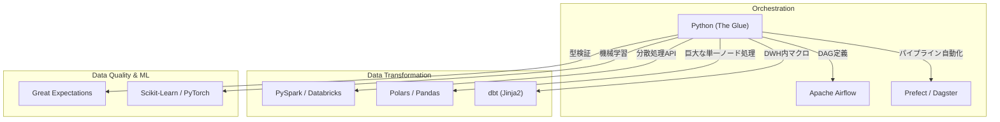

# Python Data Engineering Essentials

### 1. 【エンジニアの定義】Professional Definition

> **Python (データ基盤における)**:
> 機械学習からデータエンジニアリングまで、データ領域における事実上の共通言語。単なるスクリプト言語ではなく、PySpark、pandas、Airflow、dbt（内部Jinja）など、モダンデータスタックのツール群を接着する「グルー（接着剤）」として機能する。

---

### 2. 【0ベース・深掘り解説】Gap Filling

#### 📦 なぜデータ基盤はPython一強なのか？
かつて企業のETL処理はJavaやScalaで書かれていました。高速だからです。
しかし現在、データパイプラインは「いかに早くビジネス要件に合わせてSQLを組み立てるか」にシフトしました。Pythonは遅いと言われますが、それは**誤解**です。Pythonが遅いのは「for文で1行ずつ処理した時」だけであり、PySparkやPolarsを介して「C言語やRustで書かれた計算エンジンに命令を出す」分には、Javaと同じ速度が出ます。
手軽に書けて、内部は超高速。これがPython一強の理由です。

#### 🐍 Pandas から PySpark(分散) への意識改革
データエンジニアとしてPythonを書く際、単なるウェブエンジニアと最も異なるのが「**分散処理への理解**」です。
Pandasは1台のPCのメモリ内で動きますが、データが1TBを超えると `MemoryError` で落ちます。そこでPySparkを使います。Pythonで書いたコードは通信（RPC）を通じてクラスター上の数千のWorkerノードに翻訳され実行されます。「今自分が書いているコードは、マスターとワーカーのどちらで動くのか？」を意識しないと、平気でクラスターを破壊するコードを書いてしまいます（例：巨大なイテレータをワーカーからCollectしてしまう等）。

---

### 3. 【アーキテクチャの視覚化】Visual Guide

Pythonがモダンデータスタックの様々な領域をいかに繋いでいるか。

---

### 💡 この用語のまとめ (Key Takeaways)
*   **Pythonの役割**: 計算そのものを行うのではなく、CやRustで書かれた高速エンジンに「命令を出す」指揮官。
*   **関数型へのシフト**: データ処理コードは状態を持たない（副作用のない関数）純粋関数型に近い書き方が求められる。
*   **メモリの境界に敏感になる**: ローカルの16GBメモリと、クラウドの数TBの分散メモリの違いを常に意識してAPIを使い分ける。
