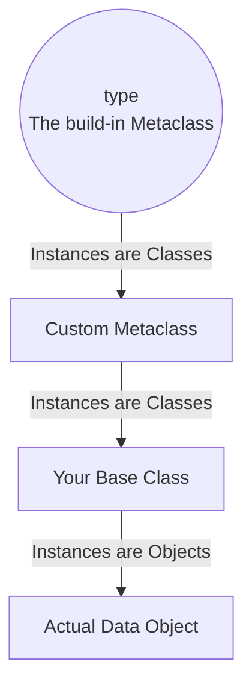

# Metaclasses (Advanced Object Creation)
### 1. 【課題解決のメカニズム】Mechanism of Problems
**「クラスそのもの」を作る黒魔術**
オブジェクト指向において、通常「クラス」は「インスタンス（具体的なモノ）」を作るための設計図です。では、「クラスという設計図自体」を作るものは何でしょうか？それが「メタクラス（Metaclass）」です。
データモデリングやORM（SQLAlchemy, Django ORMなど）を作る場合、「ユーザーが普通にクラスを定義しただけで、裏側で勝手にバリデーションを追加し、DBのテーブルスキーマと紐付ける」といったフレームワーク側の魔法が必要になります。メタクラスは、この魔法を実現する究極のツールです。

### 2. 【アーキテクチャの真髄】Architectural Deep Dive
Pythonにおいてクラスはそれ自体が「オブジェクト（`type`クラスのインスタンス）」です。
通常のクラスが `__init__` でインスタンスを初期化するように、メタクラスは `__new__` や `__init__` メソッドを持ち、そこで「新しく定義されようとしているクラスのメソッドや属性」をインターセプト（横取り）して書き換えることができます。

### 3. 【実務への応用】Practical Application
* **実務での制限事項**: 「メタクラスは99%のユーザーにとって不要である」(Tim Peters) という名言の通り、自前でデータフレームワークやORMをフルスクラッチ（開発）するのでない限り、データチームのアプリケーションコード内にメタクラスを実装するのは、保守性の観点から強力なアンチパターンとなります。しかし、「dbtなどの内部実装がどのようにSQLをパース・マッピングしているか」を理解するための教養として非常に価値が高いです。
