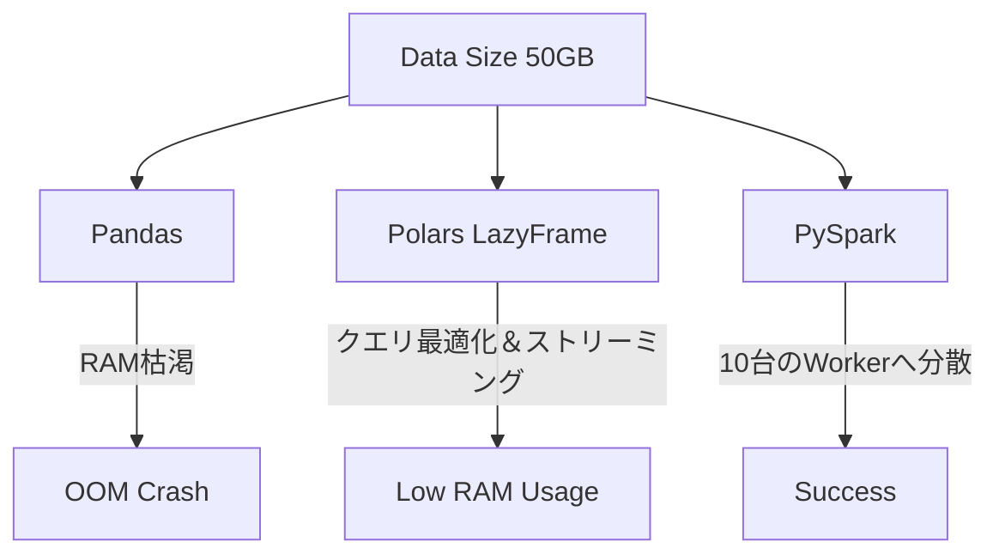

# Pandas & Polars for Data Manipulation

### 1. 【エンジニアの定義】Professional Definition
> **Pandas**:
> メモリ上（シングルノード）で行うデータ分析のデファクトスタンダード。裏側はC/CythonとNumPyベース。
> **Polars**:
> Rustで書かれた、Pandasの次世代を担うマルチスレッド対応の超高速データフレームライブラリ。

### 2. 【0ベース・深掘り解説】Gap Filling
#### 🚦 Pandasの限界と `MemoryError`
Pandas最大の弱点は「手元のPCのRAMを超えるデータは扱えない」ことです。データ量が10GBあり、PCのメモリが16GBの場合、処理の中間マージ等でメモリ使用量は容易に3倍（30GB）に膨れ上がり、プログラムが落ちます。
ここでデータエンジニアは「クラウドに持っていきPySparkで分散処理する」か、「ローカルで爆速・省メモリのPolarsに載せ替える」かの設計判断（アーキテクト）を迫られます。

### 3. 【アーキテクチャの視覚化】Visual Guide

### 💡 この用語のまとめ (Key Takeaways)
* **Pandas**: 小〜中規模（数GB以下）のデータ探索用。
* **Polars**: ローカル最強の超高速＆遅延評価（Lazy）ライブラリ。
* **設計の要**: データのスケールに合わせて、ライブラリを適切に移行（マイグレーション）できるのがプロ。
