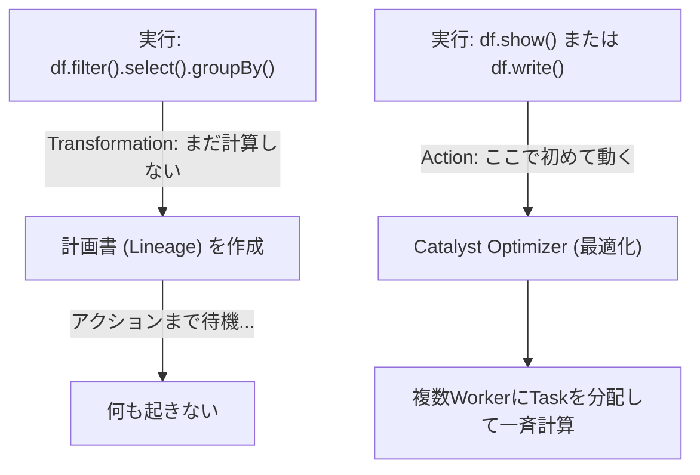

# PySpark Fundamentals

### 1. 【エンジニアの定義】Professional Definition

> **PySpark**:
> Apache Spark（分散処理エンジン）をPythonから呼び出すためのAPI。裏側ではPy4Jというライブラリを通じてJava Virtual Machine (JVM) 上のSparkコアエンジンと通信し、高速なビッグデータ処理を行う。
> 
> **Lazy Evaluation (遅延評価)**:
> PySparkは、「変換処理（`filter`, `select` 等）」を実行してもすぐには計算を行わず、結果の出力が必要になる「アクション処理（`show`, `count`, `write` 等）」が呼ばれた段階で初めて、全体の最適化された計算ルートを設計して一気に実行する仕組み。

---

### 2. 【0ベース・深掘り解説】Gap Filling

#### 🐍 DataFrame と Pandas の決定的な違い
ローカルで動くPandasを使っていた人がPySparkに触れると、データが「見えない」ことにイライラします。
*   **Pandas**: `df = df[df['age'] > 20]` を実行すると、即座にメモリ上で計算が行われ、`df.head()` ですぐ見れます。
*   **PySpark**: `df = df.filter(df.age > 20)` を実行しても、**何も起きていません**。Sparkは「ああ、後でage>20でフィルターすればいいのね」と計画書（DAG）にメモするだけです。（これが Lazy Evaluation）。
*   そして `df.count()` (アクション) が呼ばれた瞬間、100台のサーバーに計画書を配り、一斉に計算を開始します。

#### 💻 OOM (Out Of Memory) はなぜ起きるか？
PySpark開発で最も多いエラーは「ドライバーノードのメモリ枯渇」です。
`df.collect()` や `df.toPandas()` というコマンドは、100台のサーバーに分散している数TBのデータを、**たった1台の司令塔（Driver）のメモリに一挙に集約**しようとします。容量が数GBしかないDriverは一瞬でクラッシュします。
集計や絞り込みを終えて、出力結果が確実に小さくなった（数万行程度）時だけ `collect` するのが鉄則です。

---

### 3. 【アーキテクチャの視覚化】Visual Guide

Sparkの遅延評価（Lazy Evaluation）とアクションの挙動。

---

### 💡 この用語のまとめ (Key Takeaways)
*   **PySpark**: 分散処理エンジンSparkを操るPythonの魔法の杖。裏はJVM。
*   **Lazy Evaluation**: 「実行！」と言われるまでギリギリまでサボる（最適化を考える）仕組み。
*   **Driver OOM**: 巨大データを `collect()` や `toPandas()` で一箇所に集める行為は自爆行為。
