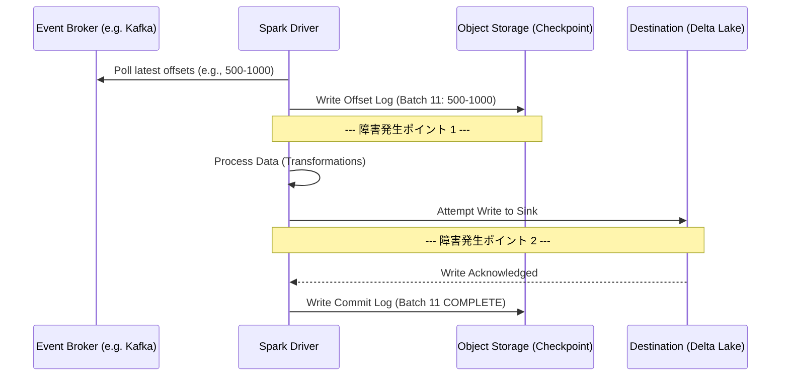

# Structured Streaming & Fault Tolerance Mechanics
### 1. 【課題解決のメカニズム】Mechanism of Problems
**「マイクロバッチの中断と再開」における一貫性の担保**
毎秒数万件のセンサーデータやアクセスログをKafkaやEvent Hubsからリアルタイムに取り込むデータエンジニアリングにおいて、「ノード障害（クラッシュ）」は例外的な事象ではなく、日常的な設計前提として組み込まれなければなりません。
クラッシュ時にストリーム処理を再起動した際、単に「どこまで読んだか」を記録するだけでは、「データを重複して処理してしまう（At-least-onceの罠）」または「途中のデータを読み飛ばしてしまう（At-most-onceの罠）」問題が発生します。
エンタープライズが要求する「確実に1回だけ処理される（Exactly-Once Semantics）」を実現するため、Spark Structured Streamingは「ソース側の確実なリプレイ機能」と「シンク側のトランザクション管理」をチェックポイント（Checkpointing）と先行書き込みログ（WAL）で結びつけています。

### 2. 【アーキテクチャの真髄】Architectural Deep Dive
**Checkpointing, WAL, and Exactly-Once Semantics**
SparkのExactly-once保証は、以下の精密な協調動作によって成り立ちます。

1. **オフセットログ (Offset Log)**:
   各マイクロバッチの処理を開始する「前」に、Spark Driverは対象となるメッセージ範囲（例: KafkaのトピックA、パーティション0、オフセット1000〜1500）をクラウドストレージのチェックポイントディレクトリにある `offsets` サブフォルダへ JSON として書き留めます。
2. **実行 (Execution) と 状態保存 (State Store)**:
   ストリーム集計（例えば過去1時間のウィンドウ集計）を行う場合、これまでの集計結果（中間状態）をメモリ上ではなく、HDFS互換ストレージ（Deltaなど）上の `state` フォルダに永続化させながら処理を進めます。
3. **コミットログ (Commit Log)**:
   Sink（例えばDelta Tableへの書き込み）が正常に完了した直後、Driverは `commits` サブフォルダに行き「バッチID 42 は完全に完了した」というログを書き込みます。

この厳格なシーケンスにより、もしジョブがクラッシュした場合、システムは以下のリカバリ判断を自律的に下します：
- `offsets` には手掛かりがあるが、`commits` に記録がない場合：処理中に死んだと判断し、保存された全く同じオフセット範囲をKafkaから再取得し、全く同じバッチ（再計算）を実行する。
- Target Sinkが冪等（Idempotent：何度同じデータを流しても結果が同じ）な設計であれば、書き込みが重複することなく完全な復旧を遂げます。

### 3. 【実務への応用】Practical Application
* **チェックポイント・ディレクトリの物理分離**:
  チェックポイントの場所を、出力先のテーブルと同じ階層に置くのは運用上のアンチパターンです。ストレージが満杯になったり、意図せず削除された際のブラスト半径（被害範囲）を分けるため、専用のセキュアなADLSコンテナなどに分離すべきです。
* **スキーマ進化とトポロジ変更の罠**:
  コードを修正し、`groupBy()` の条件キーを増やしたり減らしたり（集計トポロジの変更）してデプロイすると、以前のチェックポイントの状態（State）と互換性がなくなり、起動時に復旧に失敗します。この場合、ストリーミングジョブのビジネス要件上「過去の状態を引き継ぐ必要がない」のであれば、チェックポイントディレクトリを新規作成し、Kafkaの最初または最新のオフセットからクリーンスタートする運用設計が必要です。
